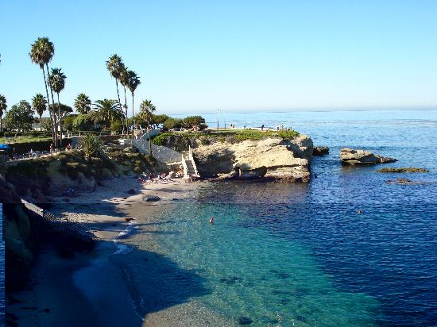

# Day 2 (Dec 18) Activity 1
### La Jolla Cove 10:30am

  After breakfast, the first activity is just nearby the restaurant and it will start from 11:00am at La Jolla Cove.
  La Jolla Cove is a famous natural ecological area in Southern California, you can see the lovely seals on the beach, as well as flying seagulls and small squirrels running around.

  |Where        |When       |Total_cost|
  |:-----------:|:---------:|:--------:|
  |La Jolla Cove|  10:30am  |   Free   |
