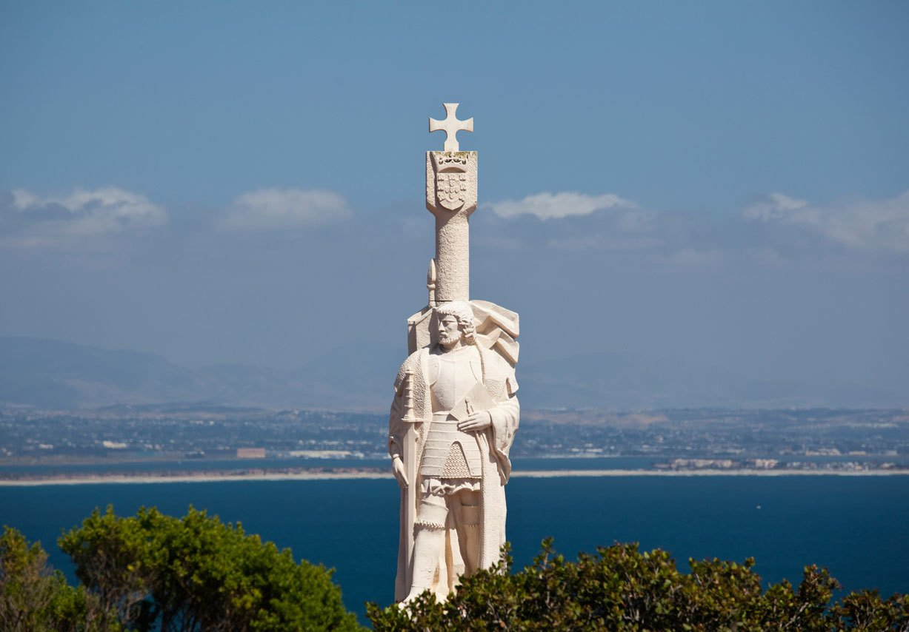

# Day 2 (Dec 18) Activity 2
### Cabrillo National Monument 2:00 pm)

Standing on the edge of the Cabrillo National Monument can see the beautiful sea view from the top(many people said that this is the best place to see the see view in San Diego), and the border of San Diego and Mexico is also able to see.

Cabrillo Entrance Fee - Per non commercial vehicle - **$10.00 USD**

|Where                      |When     |Total cost|
|:-------------------------:|:-------:|:--------:|
|Cabrillo National Monumenth|2-6:00 pm|   $10    |   
