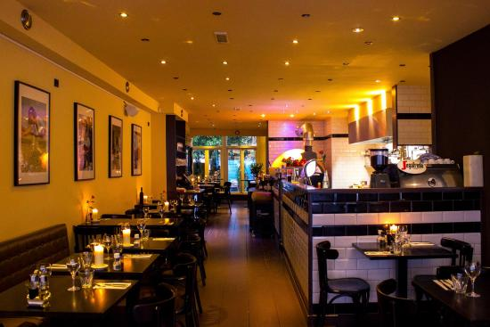

# Day 1 (Dec 17) Dinner
### Buona Forchetta (6:30 pm)
[Location: 3001 Beech St, San Diego, CA 92102, USA](https://www.google.com/maps/place/Buona+Forchetta/@32.721138,-117.1322438,17z/data=!4m13!1m7!3m6!1s0x80d9537e30ec295f:0xb679f7dd4a7c2e6!2s3001+Beech+St,+San+Diego,+CA+92102!3b1!8m2!3d32.721138!4d-117.1300551!3m4!1s0x80d9537e305d3911:0x2108857782e4a0ce!8m2!3d32.7211402!4d-117.1300439)

[Website: buonaforchettasd.com](http://buonaforchettasd.com/)

  Exquisite dinner. A variety of Prosciutto pizza are fresh and delicious, too much creative pizza. Other pasta, pasta and dessert are good, no one dish has made me disappointed, point a bottle of red wine will be better ~

  

|Where to eat  |When to eat|What to eat                |Total Cost|
|:------------:|:---------:|:-------------------------:|:--------:|
|The Kebab Shop|8 pm       | Midditeranean/Turkish food|  $100    |
