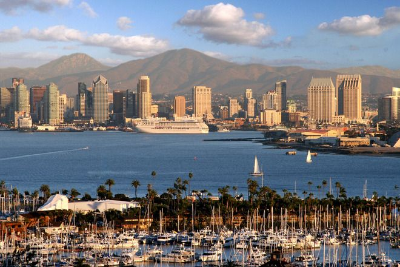

# Trip-Plan
This trip plan is for our end-of-the-semester trip to San Diego CA

## The Start of the idea
**Goal:** Relax from the Finals and escape from the winter.

**Destination:** San Diego, CA

**Fee Estimation:** $8500

You can find our Detail initial planning [here](https://docs.google.com/document/d/18EUmW5baUnwzp9AeuI0C6LKgkhOAH5W0ZwoLf-9n3RU/edit?usp=sharing)

## Brief Summary about our developement procedure

Our team 18 applied **Scrum** to manage the whole process. In the last two weeks development period, we had **4 all-hands meetings**, including **_Product owner Anes_**, **_Scrum master Wenyi_**, **_developers Chenchen, Jianshen and Xinzhou_**, to review previous work and plan future work. Besides, we had **focus meetings**, which just includes Scrum master and developers, to distribute tasks for just 15 minutes every day. 

All our developing procedures can be monitered in [Axosoft](https://xinzhou.axosoft.com/) and [Github](https://github.com/Wenyilu1990/Trip-Plan).

### Thanks for watching!
