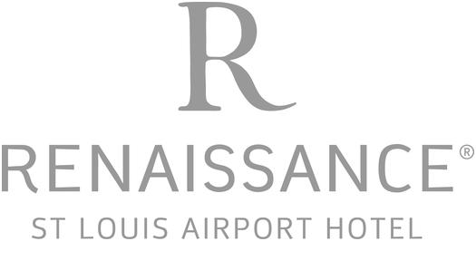

# Transportation day one (go to the airport)
**1. Parking lot comparison**
* Because the price for hotel parking is much cheaper, so the next table compares parking price rate of different hotels.

| Hotel names | Price rate | shuttle bus running time |
| --- | --- | --- |
| Hilton St.Louis Airport | 4.99 | 24/7 Every 15 min |
| Renaissance Hotel STL | 4.49 | 24/7 Every 20 min |
| Crowne Plaza STL | 4.49 | 4am - 1am Every 30 min |
| Quality Inn STL | 4.50 | 24/7 Every 30 min |
| Comfort Inn and Conference Center STL | 4.25 | 6:15 -10:45 pm |

Information are from [Global parking](http://globalairportparking.com/) 

**2. Dicission Making**
* After comparision, we decided to park in Renaissance Hotel STL, **_becuase first of all_** the price rate is cheaper than average rate; **_Secondly_** the location is just 1 mile away from the airport; **_Thirdly_** the suttle bust is 24/7 hours, every 20 minutes will have next turn, which means we do not have to hurry.

**3. Total Price for 5 days**
* $22.45

**4. Booking confirmation**

